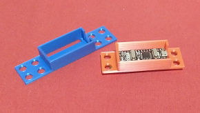
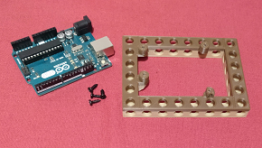
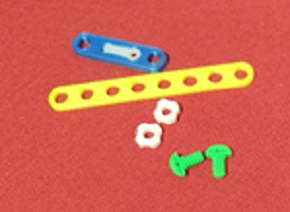

# Electronics Stemfie

Suports electrónics amb compatibilitat STEMFIE

Electronics Stemfie es una llibreria STL de suports per tarjes de control, sensors i actuadors 
amb compatibilidad Stemfie realitzada per [Jordi Mayné](https://github.com/maynej) 

Stemfie es un projecte de construcció lliure, que s'imprimeix en 3D (http://stemfie.org) 

Pretén facilitar l'automatització de les construccions amb targes Arduino, Microbit, ESP...

Tota la [documentació es pot trobar en PDF](https://github.com/maynej/Electronics-Stemfie/tree/main/Doc).

[STL per imprimir] (https://github.com/maynej/Electronics-Stemfie).

Suports 3D
  
Descripció         | Imatge          | Arxiu         
------------- | ------------- | ------------- 
Suport Arduino Nano i tapa | | [Arduino Nano](CPU/ArduinoNanoStemfie.stl),[ArduinoNano 2](CPU/ArduinoNano2Stemfie.stl),[Tapa Arduino Nano] (CPU/TapaArduinoNanoStemfie.stl)
Suport Bateria Li-ion 18650| | [18650](CPU/18650Holder2Stemfie.stl)
Suport Arduino i compatibles com UNO, Leonardo, Wemo, ESPduino, ESP8266, Alhambra II|| [Arduino Base](CPU/ArduinoBaseStemfie.stl) 
Suport Expansió Micro:bit| |[Microbit](CPU/MicrobitBaseStemfie.stl)  
Suport Expansió ESP| |   
Suport Motor DC TT| |[Motor TT L1](Motors/MotorDC_TT_L1_mClonSTEMFIE.stl),[Motor TT L2](Motors/MotorDC_TT_L2_mClonSTEMFIE.stl), [Motor TT R1](Motors/MotorDC_TT_R1_mClonSTEMFIE.stl),[Motor TT R2] (Motors/MotorDC_TT_R2_mClonSTEMFIE.stl) 
Suport Motor DC N2 Reductora| | [Motor N2 Reductora](Motors/Motor_N2_Stemfie.stl)
Suport Motor Pas a Pas 28BYJ‐48| |[28BYJ-48 6V](Motors/28BYJ-48_6V_Stemfie.stl),[28BYJ-48 H](Motors/28BYJ-48_H_Stemfie.stl),[28BYJ-48 V](Motors/28BYJ-48_V_Stemfie.stl) 
Suport Servo-motor SG9| | https://github.com/maynej/Electronics-Stemfie/tree/main/Servomotor
Suport palanca Servo-motor SG9| |[Adapter SG9] (Sensor/Servo9GAdapter_Stemfie.stl)
Suport Sensor Ultrasons HC‐SR04‐P| |[HC-SR04]  
Suport Sensor Llum LDR| | [LDR L](Sensor/LDRSensorL_mClonSTEMFIEstl),[LDR R](Sensor/LDRSensorL_mClonSTEMFIEstl)

