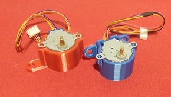
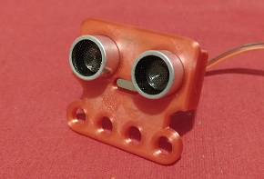

# Electronics supports with Stemfie compatibility

Suports electrónics amb compatibilitat STEMFIE. 

Electronics Stemfie es una llibreria STL de suports per tarjes de control, sensors i actuadors amb compatibilitat Stemfie.

Realitzada per [Jordi Mayné](https://github.com/maynej) des de Mechatronic Study 

STEMFIE es un projecte de construcció lliure, que s'imprimeix en 3D (http://stemfie.org) 

Pretén facilitar l'automatització de les construccions amb targes de control Arduino, Microbit, ESP..., Sensors, Servos, motors...

Tota la [documentació es pot trobar en PDF](https://github.com/maynej/Electronics-Stemfie/tree/main/Doc). També en castellà i anglés.

STL per imprimir [aquí](https://github.com/maynej/Electronics-Stemfie).

## Suports 3D
  
Descripció         | Imatge          | Arxiu         
------------- | ------------- | ------------- 
Suport Arduino Nano i tapa | | [Arduino Nano](CPU/ArduinoNanoStemfie.stl), [Arduino Nano 2](CPU/ArduinoNano2Stemfie.stl), [Tapa Arduino Nano](CPU/TapaArduinoNanoStemfie.stl)
Suport Bateria Li-ion 18650| | [18650](CPU/18650Holder2Stemfie.stl)
Suport Arduino i compatibles, com UNO, Leonardo, Wemo, ESPduino, ESP8266, Alhambra II|| [ArduinoUNO Base](CPU/ArduinoBaseStemfie.stl) 
Suport Expansió Micro:bit| |[Microbit](CPU/MicrobitBaseStemfie.stl)  
Suport ESP8266 L293 | | [NodeMCU Motors DC](CPU/NodeMCUBaseStemfie.stl)
Suport ESP8266 I/O | | [NodeMCU I/O](CPU/ESP8266IOStemfie.stl)
Suport Motor DC TT| |[MotorTT L1](Motors/MotorDC/MotorDC_TT_L1_mClonSTEMFIE.stl), [MotorTT L2](Motors/MotorDC/MotorDC_TT_L2_mClonSTEMFIE.stl), [MotorTT R1](Motors/MotorDC/MotorDC_TT_R1_mClonSTEMFIE.stl), [MotorTT R2](Motors/MotorDC/MotorDC_TT_R2_mClonSTEMFIE.stl) 
Suport MotorN20 DC Reductora| | [MotorN20 ](Motors/MotorDC/Motor_N2_Stemfie.stl)
Suport Motor Pas a Pas 28BYJ‐48| |[28BYJ-48 6V](Motors/MotorPAP28BYJ-48/28BYJ-48_6V_Stemfie.stl), [28BYJ-48 H](Motors/MotorPAP28BYJ-48/28BYJ-48_H_Stemfie.stl), [28BYJ-48 V](Motors/MotorPAP28BYJ-48/28BYJ-48_V_Stemfie.stl) 
Engranatge per Motor 28BYJ-48| |[28BYJ-48 6V](Motors/MotorPAP28BYJ-48/
Suport Servo-motor SG9| | [ServoSuport 3H](ServoMount/SG9/ServoSuport3HStemfie.stl), [ServoSuport 3V](ServoMount/SG9/ServoSuport3VStemfie.stl), [ServoSuport 5H](ServoMount/SG9/ServoSuport5HStemfie.stl), [ServoSuport 3mig](ServoMount/SG9/ServoSuport4migStemfie.stl)
Suport palanca Servo-motor SG9| |[Adapter SG9](ServoMount/SG9/Servo9GAdapter_Stemfie.stl)
Suport Servo-motor MG996| | [ServoSuport H1](ServoMount/MG996/ServoMG966_H1.stl), [ServoSuport H2](ServoMount/MG996/ServoMG966_H2.stl), [ServoSuport V1](ServoMount/MG996/ServoMG966_V1.stl), [ServoSuport V2](ServoMount/MG996/ServoMG966_V2.stl), [ServoSuport V3](ServoMount/MG996/ServoMG966_V3.stl)
Suport palanca Servo-motor MG996| |[Brace 2 MG996](ServoMount/MG996/Servo_MG996_Brace2.stl), [Brace 3 MG996](ServoMount/MG996/Servo_MG996_Brace3.stl), [Brace 4 MG996](ServoMount/MG996/Servo_MG996_Brace4.stl), [Brace 5 MG996](ServoMount/MG996/Servo_MG996_Brace5.stl),
Suport Sensor HC-SR04| |[HC-SR04 Asimetric 3H](SensorsMount/SensorAsimetric3H_Stemfie.stl), [HC-SR04 Asimetric 3V](SensorsMount/SensorAsimetric3Stemfie.stl), [HC-SR04 Asimetric 4V](SensorsMount/SensorAsimetric4Stemfie.stl)   
Suport Sensor Llum LDR| | [LDR L](SensorsMount/LDRSensorL_STEMFIE.stl), [LDR R](SensorsMount/LDRSensorL_STEMFIE.stl)

## Llicència

Creative Commons Attribution-NoComercial-ShareAlike 4.0 International (CC BY-NC-SA 4.0)  

## QR

 <a href="https://www.codigos-qr.com/en/qr-code-generator/" target="_blank" id"qrgenerator">Qr Code Generator</a>

